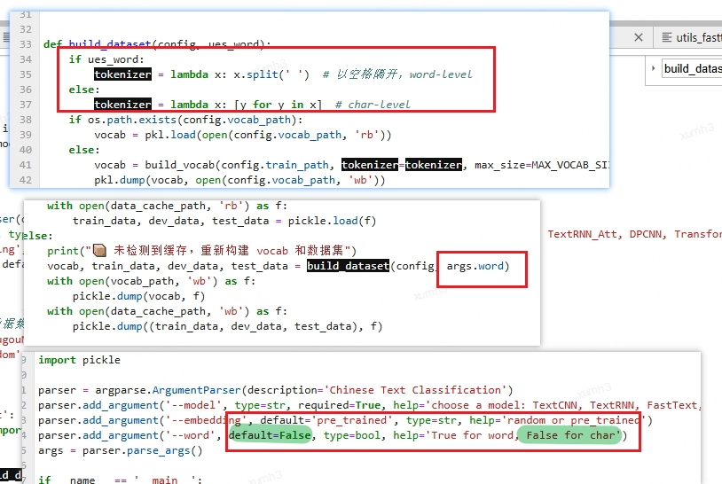

# 训练

模型定义：models

数据集：THUCNews/data/*，具体数据集格式参照train.txt，test.txt和dev.txt

```
# 训练并测试：
# TextCNN
python run.py --model TextCNN

# TextRNN
python run.py --model TextRNN

# TextRNN_Att
python run.py --model TextRNN_Att

# TextRCNN
python run.py --model TextRCNN

# FastText, embedding层是随机初始化的
python run.py --model FastText --embedding random 

# DPCNN
python run.py --model DPCNN

# Transformer
python run.py --model Transformer
```

# 推理

```
python eval.py

```


# 默认分词是char-level

不是调用外部库的 tokenizer（比如 transformers 里的 BertTokenizer），而是用 Python 的 lambda 表达式自定义了一个非常简单的 tokenizer：

tokenizer 本质就是一个 Python 函数，用来把一整段字符串拆成 词或字符序列 。

依次：utils_fasttext.py、run.py、run.py



# FastText, embedding层是随机初始化的

python run.py --model FastText --embedding random

activate env_0429

utils_fasttext.py：里面有两行可以自定义修改间隔符号 也就是训练数据集那些 文本和评分之间的间隔符号

还有就是他这个class 从0-x 必须0开始 因为pytorch语法的原因

---

(env_0429) D:\c_projects\0429-文本质量\Chinese-Text-Classification-Pytorch-master_90F1-score>python run.py --model FastText --embedding random
Loading data...
Vocab size: 4306
799it [00:00, 11333.69it/s]
99it [00:00, 12324.47it/s]
101it [00:00, 9156.88it/s]
batch_size: 128
len(batches): 799
n_batches: 6
batch_size: 128
len(batches): 99
n_batches: 0
Traceback (most recent call last):
  File "run.py", line 41, in `<module>`
    dev_iter = build_iterator(dev_data, config)
  File "D:\c_projects\0429-文本质量\Chinese-Text-Classification-Pytorch-master_90F1-score\utils_fasttext.py", line 160, in build_iterator
    iter = DatasetIterater(dataset, config.batch_size, config.device)
  File "D:\c_projects\0429-文本质量\Chinese-Text-Classification-Pytorch-master_90F1-score\utils_fasttext.py", line 112, in __init__
    raise ValueError("n_batches cannot be zero. Please check your data and batch_size.")
ValueError: n_batches cannot be zero. Please check your data and batch_size.

这个错误说明： **你的验证集（dev）中样本数量太少，不足以构成一个 batch** 。

---

## ✅ 错误详细分析：

* **`batch_size: 128`** ：你设置的批大小是 128。
* **`len(batches): 99`** ：验证集（`dev_data`）总共只有 99 条数据。
* **`n_batches: 0`** ：因为 `n_batches = len(batches) // batch_size = 99 // 128 = 0`。

由于 `n_batches == 0`，后续代码中执行 `len(batches) % self.n_batches` 就会引发  **除以零错误（ZeroDivisionError）** ，或被我们添加的保护逻辑阻止并抛出：

```python
raise ValueError("n_batches cannot be zero. Please check your data and batch_size.")
```

---

## ✅ 如何解决：

### 方法一：**减小 `batch_size`**

由于验证集只有 99 条数据，建议将 `batch_size` 设置为一个更小的值，比如 16 或 32。

修改配置文件或传参：

```bash
python run.py --model FastText --embedding random --batch_size 16
```

或直接在 `config.py`（或类似配置文件）中修改：

```python
self.batch_size = 16
```

---

### 方法二：**在 `DatasetIterater` 中特殊处理小数据集**

如果你不想降低训练时的 batch size，而只针对验证集做处理，可以在 `build_iterator` 中判断：

```python
if len(dataset) < config.batch_size:
    batch_size = len(dataset)  # 让整个验证集作为一个 batch
else:
    batch_size = config.batch_size

return DatasetIterater(dataset, batch_size, config.device)
```

---

## ✅ 建议

通常验证集和测试集很小，为避免这种除 0 错误，建议：

* 在构建 `DatasetIterater` 时动态适配 batch size。
* 或者写一个通用防御逻辑：**当 `len(data) < batch_size` 时，直接设置 `n_batches = 1` 并让整个数据作为一个 batch。**

---

需要我帮你修改 `build_iterator` 或 `DatasetIterater` 的代码以适配这种情况吗？


# 来源

加了推理脚本等

[中文文本分类 pytorch实现 - 知乎](https://zhuanlan.zhihu.com/p/73176084)


---


---
